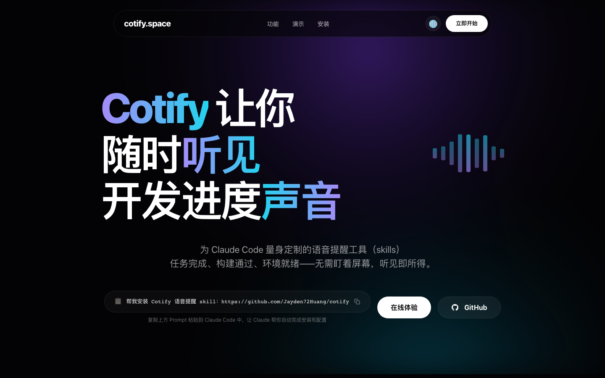

<div align="center">

# 🔔 Cotify：voice-notify skill

**让 Claude Code 开口说话主动汇报的skills——任务完成、出错、Agent 报到，全程语音播报，保持开发心流。**

[](https://www.apple.com/macos/)
[](.)
[](LICENSE)

[快速开始](#快速开始) · [English](README_EN.md) · [核心特性](#核心特性) · [Agent 团队](#agent-团队场景) · [官网](https://cotify.space)

<a href="https://cotify.space">
  
</a>

</div>

---

## 它能做什么

你在等 Claude Code 跑任务时可以去倒杯水、刷手机——**它会主动开口告诉你完成了**，不用盯着屏幕。

```
老板，全员报到完毕，团队就绪，等待您的指令！   ← Agent 全员报到
嗯... 出现了错误，请检查                        ← 出错安抚提醒
太棒了！任务执行完毕，部署已完成！              ← 大任务完成庆祝
已完成 3 项，共 7 项，加油！                    ← 进度实时播报
这么晚啊，所有任务执行完毕                      ← 深夜时段感知
```

**零依赖**：只用 macOS 内置的 `say` 和 `afplay`，安装即用，无需任何 API Key。

---

## 快速开始

### 第一步：安装 skill

```bash
git clone https://github.com/Jayden72Huang/cotify.git ~/.claude/skills/voice-notify
```

或在 Claude Code 中直接粘贴：
```
帮我安装 Cotify 语音提醒 skill：https://github.com/Jayden72Huang/cotify
```

### 第二步：下载推荐语音（首次必做）

```bash
bash ~/.claude/skills/voice-notify/scripts/setup.sh
```

脚本会自动检测环境，并引导你下载最接近 Siri 中文音色的 `莉莉 (Premium)`。

**手动路径：**
```
系统设置 → 辅助功能 → 朗读内容 → 管理语音 → 中文（中国大陆）→ 莉莉 (Premium) ⬇
```

### 第三步：在 Claude Code 中开启

```
你：帮我开启语音提醒
Claude：好的，请问你希望哪种模式？
  · milestone（默认）— 任务完成、错误、成就时播报
  · full — 每个步骤都播报
  · completion — 只在最终完成时播报
```

---

## 核心特性

### 🎭 5 种情感预设

不同场景自动调节语速和语气词，听起来更像人在说话：

| Preset | 语速 | 语气 | 适用场景 |
|--------|------|------|---------|
| `celebrate` | 200 | 哇！太棒了！冲！ | 构建通过、任务完成 |
| `comfort` | 165 | 嗯...没事的，会好的 | 出错、失败 |
| `encourage` | 210 | 加油！冲冲冲！稳住！ | 进度播报 |
| `alert` | 210 | 注意，警告！ | 严重错误 |
| `normal` | 200 | 自然平和 | 通用通知 |

```bash
bash voice.sh "构建通过" --preset=celebrate
bash voice.sh "出现错误，请检查" --preset=comfort
```

### ⚡ 3 档情绪强度（vibe）

```bash
--vibe=chill   # 极简，无语气词，纯播报
--vibe=normal  # 默认，60% 概率随机加语气词
--vibe=hype    # 全力输出，必定有语气词
```

### 🕐 时段感知

```bash
bash voice.sh "任务完成" --time-aware
# 凌晨 → "这么晚啊，任务完成"
# 早上 → "早啊，任务完成"
# 傍晚 → "傍晚了，任务完成"
```

### 🔇 防轰炸 & 防打断

```bash
# 10 秒内同类事件只播一次
bash voice.sh "进度更新" --debounce=10

# 多条消息排队顺序播出，不互相打断
bash voice.sh "第一条" --queue
bash voice.sh "第二条" --queue
```

---

## Agent 团队场景

多个 Agent 协作时，每个角色有专属声音：

| Agent | 声音 |
|-------|------|
| PM | Lili (Premium) |
| DEV | Yue (Premium) |
| Designer | Sinji |
| Researcher | Meijia (Enhanced) |
| QA | Meijia |

**全员报到示例：**

```bash
# 每个 Agent 到达时
bash sfx.sh checkin
bash voice.sh "老板，PM 已上线，向您报到！" "Lili (Premium)" --preset=normal --queue

# 全员就绪
bash sfx.sh celebrate
bash voice.sh "全员报到完毕，等待老板指令！" --preset=celebrate --queue
```

---

## 音效列表

| 命令 | 音效 | 时机 |
|------|------|------|
| `sfx.sh celebrate` | Hero | 大任务完成 |
| `sfx.sh success` | Glass | 构建/测试通过 |
| `sfx.sh error` | Sosumi | 严重错误 |
| `sfx.sh levelup` | Purr | 成就解锁 |
| `sfx.sh coin` | Pop | 小胜利、提交 |
| `sfx.sh checkin` | Morse | Agent 报到 |
| `sfx.sh warning` | Basso | 非严重警告 |

---

## 模式切换（vn 命令）

开发过程中随时切换语音模式，不用中断 Claude Code：

```bash
vn quiet    # 🔈 安静模式：只播完成+严重错误
vn normal   # 🔊 正常模式（默认）
vn mute     # 🔇 完全静音
vn hype     # 📢 全开：每步都播，语气词拉满
vn status   # 查看当前模式
```

支持缩写：`vn q` / `vn n` / `vn m` / `vn h` / `vn s`

### 快速静音（vm 命令）

不想细调模式？`vm` 是一键静音/恢复开关：

```bash
vm mute      # 🔇 静音（自动记住之前的模式）
vm unmute    # 🔊 恢复到静音前的模式
vm status    # 查看当前状态
```

支持缩写：`vm m` / `vm u` / `vm s`

> `vn` = 细粒度切换（mute/quiet/normal/hype），`vm` = 一键 mute/unmute 快捷操作。
>
> 运行 `bash setup.sh` 会自动安装 `vn` 和 `vm` 别名到你的 shell 配置中。

---

## 系统要求

| 项目 | 要求 |
|------|------|
| 系统 | macOS 12 Monterey 及以上 |
| 依赖 | 无（使用系统内置 `say` + `afplay`） |
| 推荐语音 | 莉莉 Premium（需在系统设置中下载） |

> **关于 Siri 音色：** macOS 的 `say` 命令与 Siri 使用独立的语音引擎，无法直接调用 Siri 声音。`莉莉 (Premium)` 是目前最接近 Siri 中文音色的系统语音。

---

## 完整参数速查

```
voice.sh "<消息>" [语音名] [语速] [flags...]

Flags:
  --preset=celebrate|comfort|encourage|alert|normal
  --vibe=chill|normal|hype
  --time-aware          时段感知前缀
  --queue               排队顺序播报
  --debounce=<秒>       防抖，N 秒内只播一次
  --no-filler           禁用语气词
```

---

## 文件结构

```
voice-notify/
├── SKILL.md              # Claude Code skill 配置
├── README.md             # 中文文档
├── README_EN.md          # English docs
├── LICENSE               # MIT License
└── scripts/
    ├── voice.sh          # TTS 播报核心脚本
    ├── sfx.sh            # 系统音效脚本
    ├── vn.sh             # 模式快捷切换
    ├── vm.sh             # 快速静音开关
    ├── setup.sh          # 首次环境检测与引导
    └── demo.sh           # 功能演示
```

---

## 常见问题

**Q: 播报的声音不是中文？**
A: 运行 `bash setup.sh` 检查推荐语音是否已下载。

**Q: 完全没有声音？**
A: 检查系统音量，以及 macOS 是否有「请勿打扰」开启。

**Q: 能用在 Linux 上吗？**
A: 目前仅支持 macOS。Linux 版本（基于 espeak）正在规划中。

**Q: 会消耗 Claude API Token 吗？**
A: 不会。所有播报均在本地运行，不调用任何 AI API。

---

## License

MIT © 2025

---

*如果这个 skill 让你的 vibe coding 更爽了，欢迎 ⭐ Star 支持一下！*
